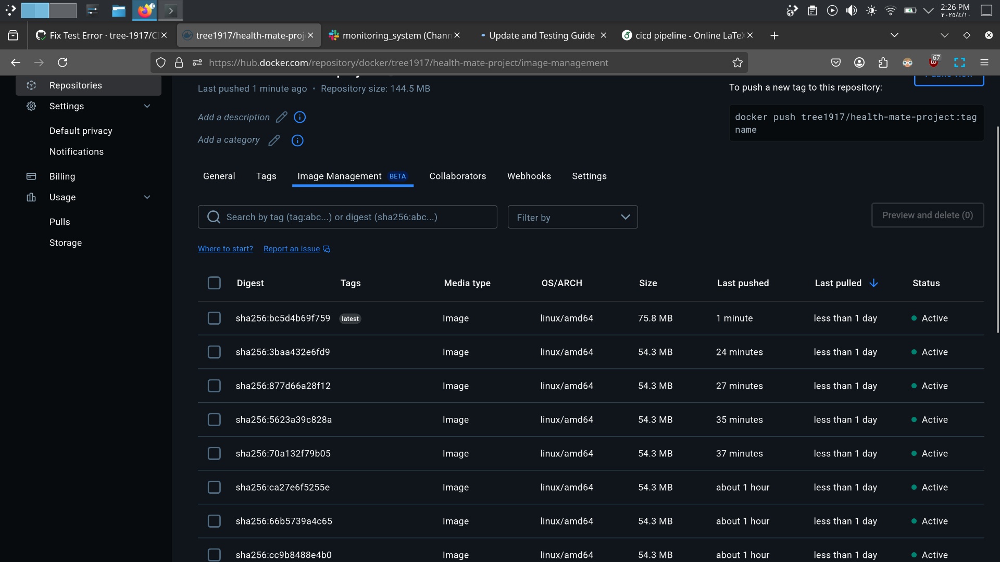

# Health Mate Project 🚑💻

## Overview

The **Health Mate Project** is a simple and effective API built with **FastAPI**. It integrates machine learning models to provide health-related predictions and insights. This project makes it easy to interact with health data and get accurate recommendations.

In this guide, we’ll cover the basic features of the project, the setup process, and how everything is automated with CI/CD. 🚀

---

## Key Features 🌟

- **FastAPI Backend**: A fast and easy-to-use framework for building APIs. ⚡
- **Machine Learning Models**: Models for health predictions like disease risk and fitness. 🤖
- **Dockerized**: The app is containerized using Docker for easy deployment. 🐳
- **CI/CD Pipeline**: Automated testing, building, and deployment via GitHub Actions. 🔄
- **Slack Notifications**: Alerts are sent to Slack when the Docker image is successfully built. 📲

---

## CI/CD Pipeline 🏗️

The CI/CD pipeline automates several processes:

1. **Checkout the Code**: The repository is checked out. 👨‍💻
2. **Run Tests**: Tests are run using `pytest` to ensure the code works as expected. ✅
3. **Build Docker Image**: If tests pass, a Docker image is created. 📦
4. **Push to Docker Hub**: The image is uploaded to Docker Hub. 🌐
5. **Slack Notification**: A Slack message is sent to notify the team of the successful build. 📢


---

## Screenshots 📸

Here are some useful screenshots from the project:

- **Docker Hub Version**:
  
  

- **GitHub Actions CI/CD**:
  
  

- **Slack Notification**:
  
  

---

## Running the Health Mate API 🏃‍♂️💨

To run the API locally:

1. **Clone the repository**:

   ```bash
   git clone https://github.com/tree-1917/Health_Mate_Project.git
   cd Health_Mate_Project
   ```

2. **Set up the environment**:

   ```bash
   python3 -m venv env
   source env/bin/activate
   pip install -r Ai_Agent/requirements.txt
   ```

3. **Start the FastAPI app**:

   ```bash
   uvicorn Ai_Agent.app.main:app --reload
   ```

   The API will be available at `http://127.0.0.1:8000`. 🌐

---

## Conclusion 🎉

The **Health Mate Project** provides a simple yet powerful API for health predictions using machine learning. With **FastAPI**, **Docker**, and an automated **CI/CD pipeline**, the project is designed to be efficient, scalable, and easy to deploy. 🚀

---

